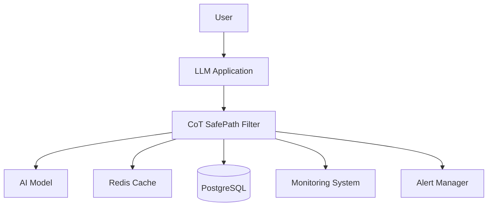
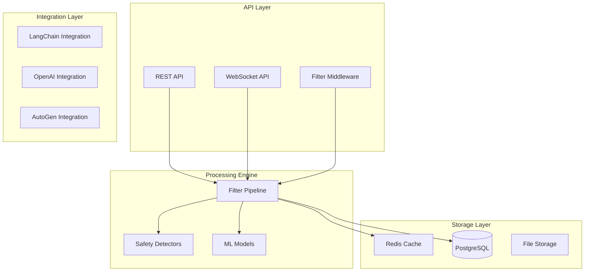
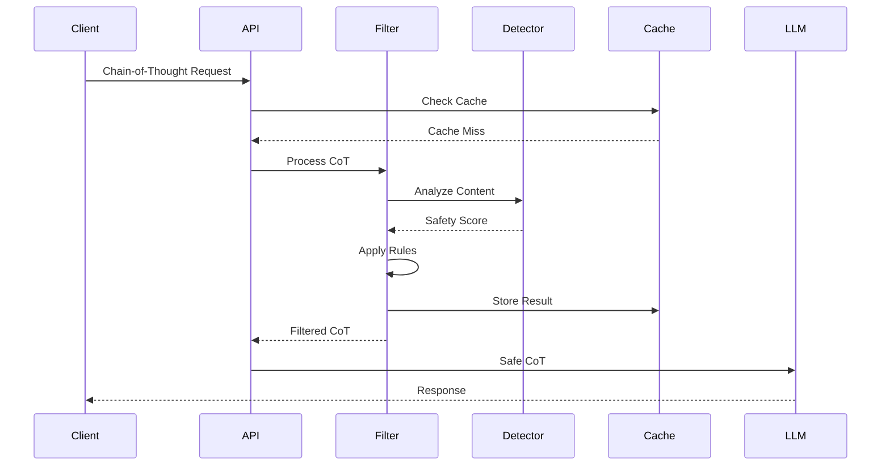
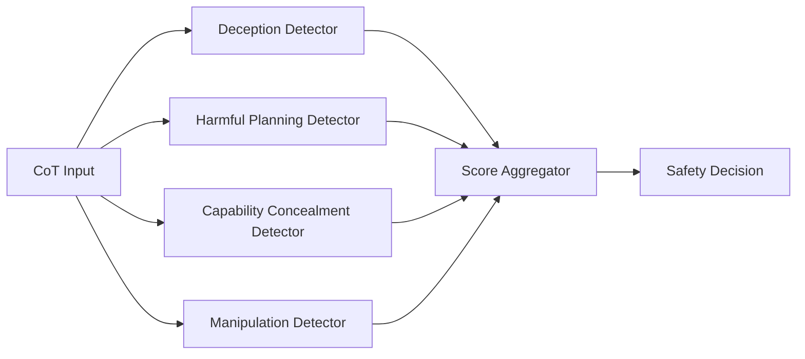
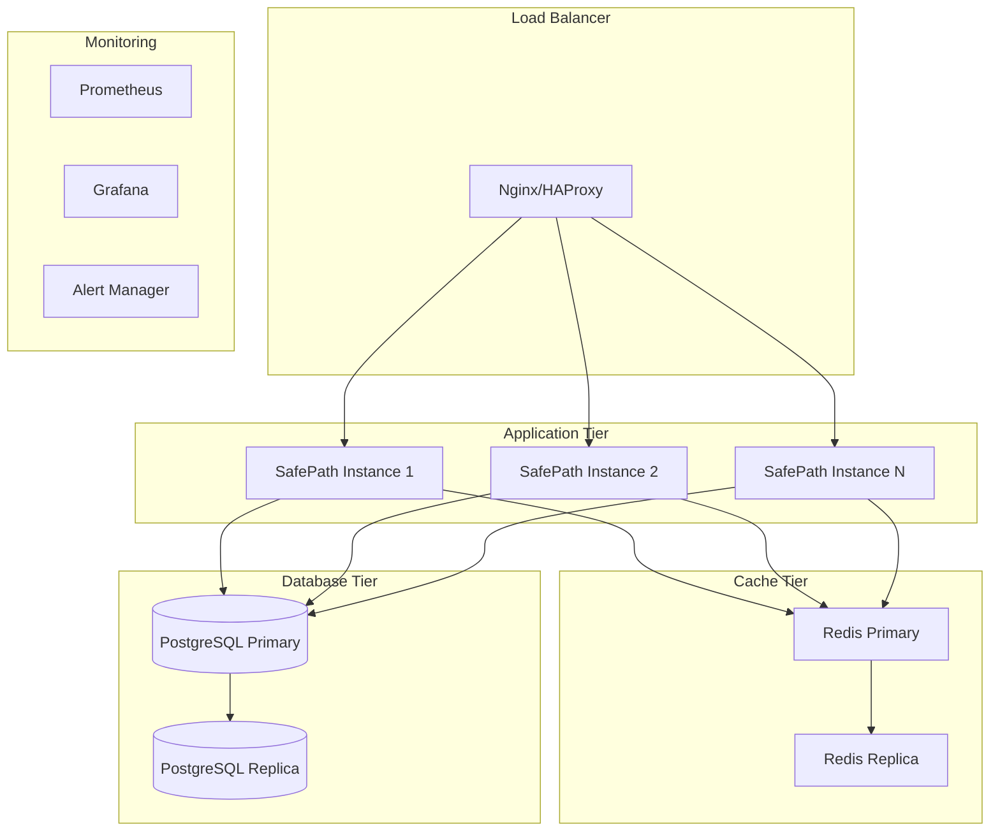
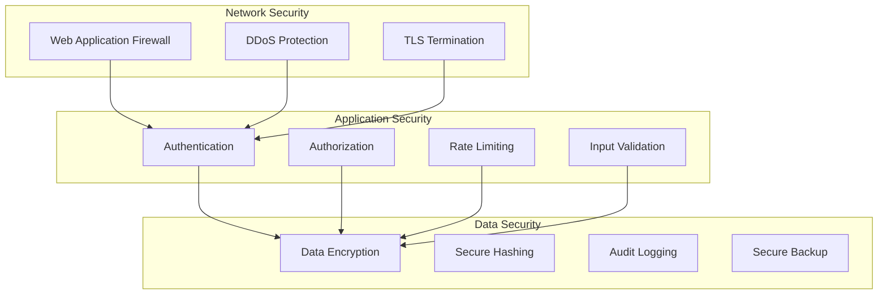
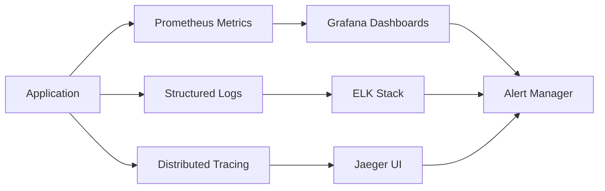
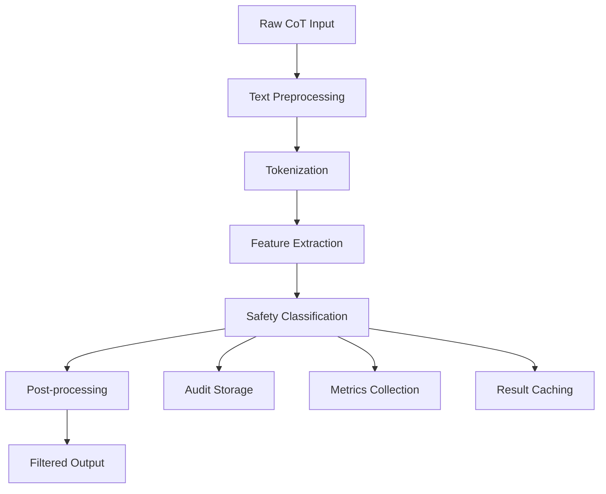

# CoT SafePath Filter - System Architecture

## Overview

The CoT SafePath Filter is a real-time middleware system designed to intercept and sanitize chain-of-thought reasoning from AI systems to prevent harmful or deceptive reasoning patterns from reaching end users.

## Architecture Principles

### Design Principles

1. **Defense in Depth**: Multiple layers of filtering and validation
2. **Fail-Safe Defaults**: Conservative behavior when in doubt
3. **Performance First**: Sub-50ms latency for most operations
4. **Extensibility**: Pluggable filter and detector components
5. **Observability**: Comprehensive logging and monitoring
6. **Security by Design**: Built with security as a primary concern

### Quality Attributes

- **Reliability**: 99.9% uptime with graceful degradation
- **Performance**: <50ms P95 latency for filtering operations
- **Scalability**: Horizontal scaling to 10,000+ requests/second
- **Security**: Zero-trust architecture with end-to-end encryption
- **Maintainability**: Modular design with clear separation of concerns

## System Context



## High-Level Architecture

### Core Components



### Data Flow



## Detailed Architecture

### API Layer

#### REST API
- **FastAPI** framework for high-performance async operations
- **OpenAPI** specification for documentation
- **Rate limiting** and **authentication** middleware
- **Request validation** and **response serialization**

#### WebSocket API
- **Real-time filtering** for streaming applications
- **Connection management** and **load balancing**
- **Backpressure handling** for high-throughput scenarios

#### Middleware Integration
- **LangChain callbacks** for seamless integration
- **OpenAI wrapper** for drop-in replacement
- **Custom adapters** for other LLM frameworks

### Processing Engine

#### Filter Pipeline

```python
class FilterPipeline:
    """Multi-stage filtering pipeline with configurable stages."""
    
    stages = [
        PreprocessingStage(),      # Text normalization and preparation
        TokenFilterStage(),        # Token-level filtering
        PatternFilterStage(),      # Pattern matching and regex
        SemanticFilterStage(),     # ML-based semantic analysis
        ContextualFilterStage(),   # Context-aware filtering
        PostprocessingStage(),     # Final cleanup and formatting
    ]
```

#### Safety Detectors



### ML Models

#### Model Architecture
- **BERT-based safety classifier** for semantic understanding
- **Transformer models** for context-aware detection
- **Ensemble methods** for improved accuracy
- **Fine-tuned models** for domain-specific detection

#### Model Pipeline
```python
class SafetyModelPipeline:
    """ML model pipeline for safety classification."""
    
    def __init__(self):
        self.tokenizer = AutoTokenizer.from_pretrained("bert-safety-v2")
        self.model = AutoModel.from_pretrained("bert-safety-v2")
        self.classifier = SafetyClassifier()
    
    def predict(self, text: str) -> SafetyScore:
        tokens = self.tokenizer(text, return_tensors="pt")
        embeddings = self.model(**tokens)
        return self.classifier(embeddings)
```

### Storage Layer

#### PostgreSQL Database

**Schema Design:**
```sql
-- Filter operations audit log
CREATE TABLE filter_operations (
    id SERIAL PRIMARY KEY,
    request_id UUID NOT NULL,
    input_hash VARCHAR(64) NOT NULL,
    safety_score DECIMAL(3,2),
    filtered BOOLEAN NOT NULL,
    filter_reason TEXT,
    processing_time_ms INTEGER,
    created_at TIMESTAMP DEFAULT NOW()
);

-- Safety detection results
CREATE TABLE safety_detections (
    id SERIAL PRIMARY KEY,
    operation_id INTEGER REFERENCES filter_operations(id),
    detector_name VARCHAR(50) NOT NULL,
    confidence DECIMAL(3,2) NOT NULL,
    detected_patterns TEXT[],
    created_at TIMESTAMP DEFAULT NOW()
);

-- Configuration and rules
CREATE TABLE filter_rules (
    id SERIAL PRIMARY KEY,
    name VARCHAR(100) NOT NULL,
    pattern TEXT,
    action VARCHAR(20) NOT NULL,
    severity VARCHAR(10) NOT NULL,
    enabled BOOLEAN DEFAULT TRUE,
    created_at TIMESTAMP DEFAULT NOW()
);
```

#### Redis Cache

**Caching Strategy:**
- **Input hashing** for duplicate detection
- **Result caching** with TTL-based expiration
- **Session storage** for stateful filtering
- **Rate limiting** counters and windows

```python
class CacheStrategy:
    """Redis caching strategy for SafePath operations."""
    
    CACHE_KEYS = {
        "filter_result": "safepath:filter:{hash}",
        "safety_score": "safepath:score:{hash}",
        "rate_limit": "safepath:rate:{user_id}",
        "session": "safepath:session:{session_id}"
    }
    
    TTL_SETTINGS = {
        "filter_result": 3600,  # 1 hour
        "safety_score": 1800,   # 30 minutes
        "rate_limit": 60,       # 1 minute
        "session": 86400        # 24 hours
    }
```

### Integration Layer

#### Framework Integrations

**LangChain Integration:**
```python
from cot_safepath.integrations.langchain import SafePathCallback

callback = SafePathCallback(safety_level="strict")
chain = LLMChain(llm=llm, callbacks=[callback])
```

**OpenAI Integration:**
```python
from cot_safepath.integrations.openai import SafeOpenAI

safe_client = SafeOpenAI(api_key="...", safety_config=config)
response = safe_client.chat.completions.create(...)
```

## Deployment Architecture

### Container Architecture



### Kubernetes Deployment

```yaml
apiVersion: apps/v1
kind: Deployment
metadata:
  name: safepath-filter
spec:
  replicas: 3
  selector:
    matchLabels:
      app: safepath-filter
  template:
    metadata:
      labels:
        app: safepath-filter
    spec:
      containers:
      - name: safepath-filter
        image: safepath-filter:latest
        ports:
        - containerPort: 8080
        resources:
          requests:
            memory: "512Mi"
            cpu: "250m"
          limits:
            memory: "1Gi"
            cpu: "500m"
        env:
        - name: DATABASE_URL
          valueFrom:
            secretKeyRef:
              name: db-credentials
              key: url
        - name: REDIS_URL
          valueFrom:
            secretKeyRef:
              name: cache-credentials
              key: url
```

## Security Architecture

### Security Layers



### Threat Model

**Assets:**
- AI model responses and reasoning chains
- User data and authentication tokens
- System configuration and rules
- Audit logs and monitoring data

**Threats:**
- Adversarial prompt injection
- Filter bypass attempts
- Data exfiltration
- System availability attacks
- Supply chain compromises

**Mitigations:**
- Input sanitization and validation
- Output filtering and monitoring
- Rate limiting and access controls
- Comprehensive audit logging
- Dependency scanning and updates

## Performance Architecture

### Performance Targets

- **Latency**: P95 < 50ms for filter operations
- **Throughput**: 10,000+ requests per second
- **Availability**: 99.9% uptime
- **Scalability**: Linear horizontal scaling

### Optimization Strategies

1. **Caching**: Aggressive caching of filter results
2. **Connection Pooling**: Database and Redis connection pooling
3. **Async Processing**: Non-blocking I/O operations
4. **Load Balancing**: Intelligent request distribution
5. **Resource Management**: CPU and memory optimization

### Monitoring and Observability



## Data Architecture

### Data Flow



### Data Models

**Core Data Models:**
```python
@dataclass
class FilterRequest:
    content: str
    context: Optional[str]
    safety_level: SafetyLevel
    metadata: Dict[str, Any]

@dataclass
class FilterResult:
    filtered_content: str
    safety_score: float
    was_filtered: bool
    filter_reasons: List[str]
    processing_time_ms: int

@dataclass
class SafetyDetection:
    detector_name: str
    confidence: float
    detected_patterns: List[str]
    severity: Severity
```

## Technology Stack

### Core Technologies

- **Python 3.9+**: Primary programming language
- **FastAPI**: High-performance web framework
- **PostgreSQL**: Primary database
- **Redis**: Caching and session storage
- **Transformers**: ML model framework
- **PyTorch**: Deep learning framework

### Infrastructure

- **Docker**: Containerization
- **Kubernetes**: Container orchestration
- **Prometheus**: Metrics collection
- **Grafana**: Visualization and dashboards
- **GitHub Actions**: CI/CD pipeline

### Development Tools

- **Black**: Code formatting
- **Pytest**: Testing framework
- **MyPy**: Type checking
- **Pre-commit**: Git hooks
- **Bandit**: Security scanning

## Decision Records

See the [Architecture Decision Records](./adr/) directory for detailed decisions about:

- [ADR-001: Technology Stack Selection](./adr/001-technology-stack.md)
- [ADR-002: Database Schema Design](./adr/002-database-schema.md)
- [ADR-003: Caching Strategy](./adr/003-caching-strategy.md)
- [ADR-004: Security Architecture](./adr/004-security-architecture.md)
- [ADR-005: ML Model Selection](./adr/005-ml-model-selection.md)

## Future Considerations

### Planned Enhancements

1. **Multi-modal Support**: Text, image, and audio filtering
2. **Federated Learning**: Distributed model training
3. **Edge Deployment**: Lightweight edge filtering
4. **Advanced Analytics**: ML-driven insights and reporting
5. **API Gateway**: Centralized API management

### Scalability Roadmap

- **Phase 1**: Single-region deployment (current)
- **Phase 2**: Multi-region deployment with data replication
- **Phase 3**: Global edge deployment with local processing
- **Phase 4**: Federated architecture with partner integration

---

**Document Version**: 1.0  
**Last Updated**: January 27, 2025  
**Next Review**: March 27, 2025