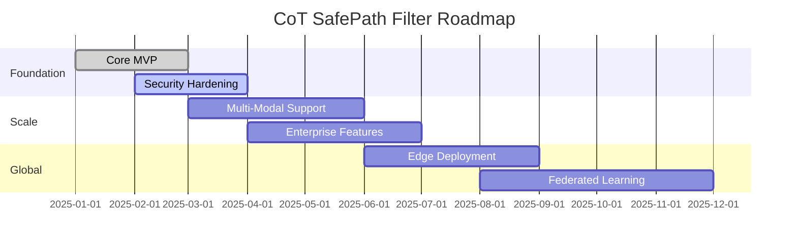

# CoT SafePath Filter - Product Roadmap

## Vision

Build the most trusted and effective real-time AI safety middleware for preventing harmful chain-of-thought reasoning patterns in AI systems.

## Product Strategy

### Mission
Protect users and society from dangerous AI reasoning by providing real-time filtering and sanitization of chain-of-thought outputs.

### Success Metrics
- **Safety**: >99.5% harmful content detection rate
- **Performance**: <50ms P95 latency for filtering operations  
- **Adoption**: 1000+ organizations using SafePath in production
- **False Positives**: <2% false positive rate on benign content

## Roadmap Overview

## Release Timeline

### Q1 2025 - Foundation (v0.1.0 - v0.3.0)

#### v0.1.0 - Core MVP ✅ *Released*
- ✅ Basic text filtering pipeline
- ✅ Pattern-based detection
- ✅ REST API with FastAPI
- ✅ PostgreSQL audit logging
- ✅ Redis caching layer
- ✅ Docker containerization

#### v0.2.0 - ML Integration *In Progress*
- 🔄 BERT-based safety classification
- 🔄 Semantic analysis pipeline
- 🔄 Custom model fine-tuning
- 🔄 Performance benchmarking
- 📅 **Target**: February 15, 2025

#### v0.3.0 - Framework Integrations
- 📋 LangChain callback integration
- 📋 OpenAI wrapper implementation
- 📋 AutoGen agent support
- 📋 Streaming/WebSocket support
- 📋 Advanced configuration system
- 📅 **Target**: March 31, 2025

### Q2 2025 - Security & Scale (v0.4.0 - v0.6.0)

#### v0.4.0 - Security Hardening
- 📋 Comprehensive security audit
- 📋 Input validation strengthening
- 📋 Rate limiting enhancements
- 📋 Authentication & authorization
- 📋 Penetration testing
- 📅 **Target**: April 30, 2025

#### v0.5.0 - Performance Optimization
- 📋 Sub-20ms P95 latency target
- 📋 Horizontal scaling support
- 📋 Caching optimizations
- 📋 Load testing & tuning
- 📋 Resource optimization
- 📅 **Target**: May 31, 2025

#### v0.6.0 - Enterprise Features
- 📋 Multi-tenancy support
- 📋 Advanced analytics dashboard
- 📋 Custom rule engine
- 📋 Compliance reporting
- 📋 SLA monitoring
- 📅 **Target**: June 30, 2025

### Q3 2025 - Multi-Modal & Edge (v0.7.0 - v0.9.0)

#### v0.7.0 - Multi-Modal Support
- 📋 Image content analysis
- 📋 Audio transcription filtering
- 📋 Video content detection
- 📋 Cross-modal reasoning analysis
- 📅 **Target**: July 31, 2025

#### v0.8.0 - Edge Deployment
- 📋 Lightweight edge runtime
- 📋 Offline filtering capability
- 📋 Edge-cloud synchronization
- 📋 Regional data compliance
- 📅 **Target**: August 31, 2025

#### v0.9.0 - Advanced Analytics
- 📋 ML-driven insights
- 📋 Threat intelligence integration
- 📋 Predictive safety scoring
- 📋 Automated rule generation
- 📅 **Target**: September 30, 2025

### Q4 2025 - Global Scale (v1.0.0+)

#### v1.0.0 - Production Ready
- 📋 99.9% uptime guarantee
- 📋 Global CDN deployment
- 📋 24/7 support system
- 📋 Comprehensive documentation
- 📋 Certification compliance
- 📅 **Target**: October 31, 2025

#### v1.1.0 - Federated Learning
- 📋 Distributed model training
- 📋 Privacy-preserving updates
- 📋 Cross-organization learning
- 📋 Model governance framework
- 📅 **Target**: December 31, 2025

## Feature Priorities

### High Priority - Foundation
1. **Core Filtering Engine** - Essential functionality
2. **Security Framework** - Trust and safety
3. **Performance Optimization** - Production readiness
4. **Framework Integrations** - Ease of adoption

### Medium Priority - Scale
1. **Multi-Modal Support** - Expanding capabilities
2. **Enterprise Features** - Commercial viability
3. **Edge Deployment** - Global accessibility
4. **Advanced Analytics** - Intelligence and insights

### Lower Priority - Advanced
1. **Federated Learning** - Next-generation capabilities
2. **Custom Hardware** - Specialized optimization
3. **Regulatory Compliance** - Industry-specific needs
4. **Research Partnerships** - Academic collaboration

## Technical Milestones

### Performance Targets by Quarter

| Quarter | Latency (P95) | Throughput (RPS) | Accuracy | Uptime |
|---------|---------------|------------------|----------|--------|
| Q1 2025 | <100ms        | 1,000           | >95%     | 99.0%  |
| Q2 2025 | <50ms         | 5,000           | >98%     | 99.5%  |
| Q3 2025 | <30ms         | 10,000          | >99%     | 99.9%  |
| Q4 2025 | <20ms         | 25,000          | >99.5%   | 99.95% |

### Security Milestones

- **Q1**: Basic input validation and sanitization
- **Q2**: Comprehensive security audit and penetration testing
- **Q3**: SOC 2 Type II compliance preparation
- **Q4**: Industry certifications and compliance validation

## Market Strategy

### Target Segments

1. **AI Development Teams** - Early adopters building LLM applications
2. **Enterprise Organizations** - Companies deploying AI at scale
3. **AI Safety Researchers** - Academic and research institutions
4. **Regulatory Bodies** - Government and compliance organizations

### Go-to-Market Timeline

- **Q1 2025**: Developer preview and early access program
- **Q2 2025**: Public beta with selected customers
- **Q3 2025**: General availability and enterprise sales
- **Q4 2025**: Global expansion and partnerships

## Research & Development

### Active Research Areas

1. **Advanced Detection Algorithms**
   - Transformer-based reasoning analysis
   - Few-shot learning for new threat patterns
   - Adversarial prompt detection

2. **Performance Optimization**
   - Model quantization and pruning
   - Edge computing architectures
   - Parallel processing pipelines

3. **Multi-Modal Analysis**
   - Cross-modal reasoning detection
   - Vision-language model integration
   - Audio-visual content analysis

### Collaboration Opportunities

- **Academic Partnerships**: Research collaborations with universities
- **Industry Alliances**: Integration with major AI platforms
- **Standards Bodies**: Contributing to AI safety standards
- **Open Source**: Contributing to the broader AI safety community

## Risk Management

### Technical Risks

| Risk | Probability | Impact | Mitigation |
|------|-------------|--------|------------|
| Performance degradation | Medium | High | Continuous benchmarking, optimization |
| Model accuracy issues | Low | High | Extensive testing, validation datasets |
| Security vulnerabilities | Medium | Critical | Regular audits, security-first design |
| Scalability bottlenecks | Medium | Medium | Load testing, horizontal scaling |

### Market Risks

| Risk | Probability | Impact | Mitigation |
|------|-------------|--------|------------|
| Competitive pressure | High | Medium | Innovation focus, unique value prop |
| Regulatory changes | Medium | High | Compliance monitoring, adaptability |
| Customer adoption | Medium | High | Strong product-market fit, partnerships |
| Technology shifts | Low | High | Research investment, flexibility |

## Success Metrics

### Product Metrics
- **Filtering Accuracy**: >99.5% harmful content detection
- **Performance**: <20ms P95 latency at 25k RPS
- **Reliability**: 99.95% uptime SLA
- **Security**: Zero critical vulnerabilities

### Business Metrics
- **Adoption**: 1000+ production deployments
- **Revenue**: $10M ARR by end of 2025
- **Customer Satisfaction**: >90% NPS score
- **Market Share**: Top 3 AI safety solution

### Community Metrics
- **Open Source Contributions**: 100+ external contributors
- **Research Impact**: 10+ peer-reviewed publications
- **Industry Recognition**: Major AI safety awards
- **Standards Influence**: Active participation in standards bodies

---

**Document Version**: 1.0  
**Last Updated**: January 28, 2025  
**Next Review**: March 28, 2025